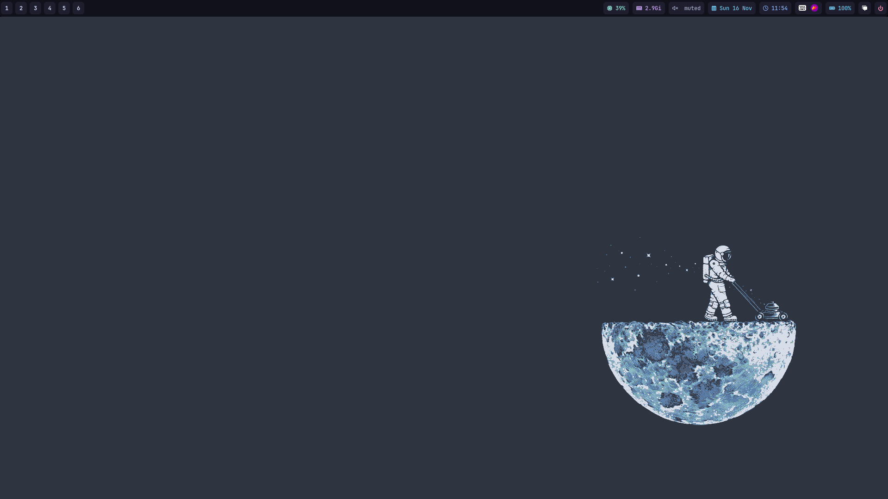

# dots

Minimal Sway Dotfiles. 🧘 Clean, light, and optimized configuration for Wayland. (Sway, Waybar, Kitty, Zsh, Rofi) 

## features

- [x] **Android mount**: Graphical mounter for Android phones

- [x] **Network Manager**: Graphical interface for NetworkManager.

- [x] **Bluetooth**: Graphical interface for bluetoothctl.

- [x] **Screenshoter**: Flameshot + grim (for wayland).

- [x] **Color picker**: Select a color on screen and copy it to clipboard.

- [x] **Clipboard history**: Greenclip graphical interface.

## programs

- **Sway** - **Tiling WM** for Wayland.

- **Waybar** - Customizable **status bar** for Wayland.

- **Kitty** - GPU-accelerated **terminal emulator**.

- **Zsh** - Powerful, interactive **extended shell**.

- **Rofi** - Application **launcher** and window switcher.

- **Vim** - Configurable, keyboard-centric **text editor**.

- **Swaync** - Sway notification center.

## hotkeys

| **Keybinding**                    | **Description (English)**                                                                    |
| --------------------------------- | -------------------------------------------------------------------------------------------- |
| **Workspace Management**          |                                                                                              |
| `$mod+[1-0]`                      | Switch to workspace 1 through 10.                                                            |
| `$mod+Alt+[1-0]`                  | Move the focused container to workspace 1 through 10.                                        |
| **Tiling & Layout**               |                                                                                              |
| `$mod+h`                          | Split the container horizontally.                                                            |
| `$mod+v`                          | Split the container vertically.                                                              |
| `$mod+s`                          | Set layout to stacking.                                                                      |
| `$mod+w`                          | Set layout to tabbed.                                                                        |
| `$mod+e`                          | Toggle between horizontal/vertical split layout.                                             |
| `$mod+Alt+f`                      | Toggle fullscreen mode for the focused container.                                            |
| `$mod+Shift+space`                | Toggle floating mode for the focused container.                                              |
| `$mod+space`                      | Focus on the next window in the same mode.                                                   |
| `$mod+a`                          | Focus the parent container.                                                                  |
| **Window Management**             |                                                                                              |
| `$mod+Return`                     | Launch the terminal (kitty).                                                                 |
| `$mod+q`                          | Kill the focused window/container.                                                           |
| `$mod+d`                          | Execute the application launcher (rofi).                                                     |
| `$mod+Shift+c`                    | Reload the Sway configuration.                                                               |
| `$mod+Shift+e`                    | Show a warning prompt to exit Sway.                                                          |
| **System**                        |                                                                                              |
| `Ctrl+$mod+Alt+l`                 | Lock the screen (swaylock).                                                                  |
| `Ctrl+$mod+Alt+p`                 | Power off the system.                                                                        |
| `Ctrl+$mod+Alt+r`                 | Reboot the system.                                                                           |
| `Ctrl+$mod+Alt+q`                 | Exit the Sway session.                                                                       |
| `$mod+Alt+n`                      | Launch Network Manager application.                                                          |
| `$mod+Alt+b`                      | Launch Rofi-based Bluetooth manager.                                                         |
| `$mod+Alt+a`                      | Launch Android Mount script.                                                                 |
| `$mod+Alt+s`                      | Take a screenshot (flameshot gui).                                                           |
| `$mod+Alt+c`                      | Execute a color picker utility.                                                              |
| `$mod+Alt+w`                      | Launch a Clipboard manager.                                                                  |
| **Focus Navigation**              |                                                                                              |
| `$mod+[left/down/up/right]`       | Move focus to the adjacent container (using set keys $left/$down/$up/$right).                |
| `$mod+[Left/Down/Up/Right]`       | Move focus to the adjacent container (using arrow keys).                                     |
| **Move Windows**                  |                                                                                              |
| `$mod+Shift+[left/down/up/right]` | Move the focused container to the adjacent position (using set keys $left/$down/$up/$right). |
| `$mod+Shift+[Left/Down/Up/Right]` | Move the focused container to the adjacent position (using arrow keys).                      |
| **Scratchpad**                    |                                                                                              |
| `$mod+Shift+minus`                | Move the focused container to the scratchpad.                                                |
| `$mod+minus`                      | Show/hide a window from the scratchpad.                                                      |
| **Media & Brightness**            |                                                                                              |
| `XF86AudioRaiseVolume`            | Increase volume by 2%.                                                                       |
| `XF86AudioLowerVolume`            | Decrease volume by 2%.                                                                       |
| `XF86AudioMute`                   | Toggle audio mute.                                                                           |
| `XF86AudioMicMute`                | Toggle microphone mute.                                                                      |
| `XF86MonBrightnessDown`           | Decrease screen brightness by 5%.                                                            |
| `XF86MonBrightnessUp`             | Increase screen brightness by 5%.                                                            |
| `XF86AudioPlay`                   | Toggle media play/pause.                                                                     |
| `XF86AudioNext`                   | Skip to the next media track.                                                                |
| `XF86AudioPrev`                   | Skip to the previous media track.                                                            |
| **Resize Mode**                   |                                                                                              |
| `$mod+r`                          | Enter resize mode.                                                                           |
| (Inside resize mode)              | Resize the focused container.                                                                |
| (Inside resize mode)              | Exit resize mode.                                                                            |
| **Notifications**                 |                                                                                              |
| `$mod+Shift+i`                    | Toggle visibility of the notification center and side-wide.                                  |
| `$mod+i`                          | Toggle visibility of the notification center.                                                |

## insipration

- **Scripts**: [gh0stzk/dotfiles](https://github.com/gh0stzk/dotfiles)

- **Sway config**: [denisse-dev/dotfiles](https://github.com/denisse-dev/dotfiles)

- **Wallpaper**: [dharmx/walls](https://github.com/dharmx/walls/tree/main)

## screenshots

